# Medical-Image-Modality-Conversion
Explore the possibility of converting medical images between modality while preserving information that's important to diagnosis

1/30/18:
After adding skip connections and Unet, brain segmentation and modality conversion results were a lot better.
Some thoughts on segmentation:
  1. these images are generated based on one scan, going to retool the dataset to input 4 scans.
  2. perhaps it's better to break up the segmentation into stages, for instance first detect and localize the tumor, then do finer segmentation; there are instances where tumor location was not correctly predicted to begin with. 
  3. a 3D base method prob helps, although i'd like to say the segmentations were originally done on a per image basis.
  4. some tricks can improve the results somewhat, like preprocessing by normalizing the MRI to adjust for some imaging artifacts, and postprocessing like adding a CRF, which is often used in segmentation methods
  
  *left is predicted segmentation, middle is ground truth, and right is brain scan(flair)
 
  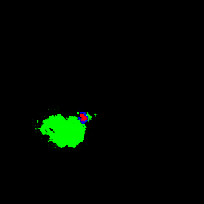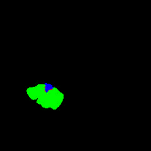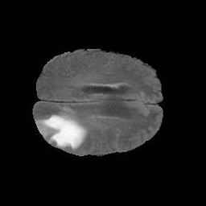!
  
  
  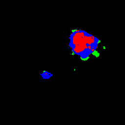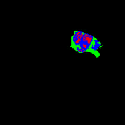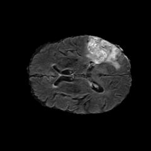!

Modality conversion:

Some thoughts: A lot better results in turns of resolutions after skip connections are added. However, the strucutre is still changing sometimes. The paper semi-supervised FusedGAN for Conditional Image Generation is probably a better structure, in turns of seperating structure (brain anatomy) with style (modality)

From Flair to T2 (these two modalities are relatively similiar, would see better contrast for anthoer pairing)

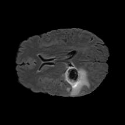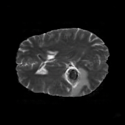

  
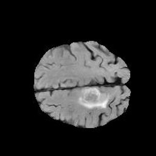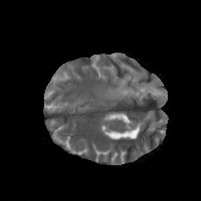

From T2 to Flair

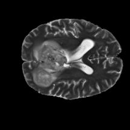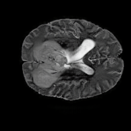    

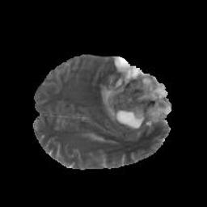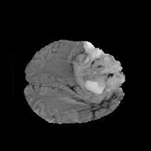

